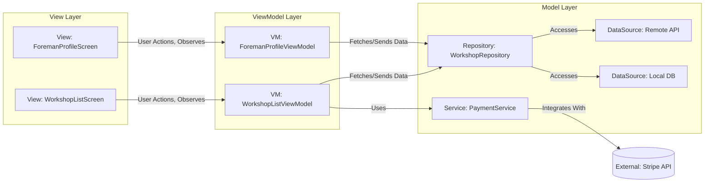

# Architecture Guidelines: MVVM in Flutter

## MVVM Pattern
This project adheres strictly to the Model-View-ViewModel (MVVM) architectural pattern. MVVM promotes a clear separation of concerns, making the codebase more modular, testable, and maintainable.

### Components:
*   **View:** In Flutter, the View is typically represented by `Widget`s. Views are responsible for the user interface (UI) and for displaying data. They observe changes in the ViewModel and update themselves accordingly. Views should be "dumb" and contain minimal logic, delegating all business logic and state management to their corresponding ViewModel.
*   **ViewModel:** The ViewModel is a Dart class that acts as an intermediary between the View and the Model. It holds the presentation logic and state for a specific View. ViewModels expose data to the View through observable properties (e.g., using `ChangeNotifier` with the **Provider** package for state management and dependency injection). They also handle user input from the View and interact with the Model layer to fetch or manipulate data. Each View should have one, and only one, corresponding ViewModel.
*   **Model:** The Model layer represents the application's data and business logic. It typically consists of:
    *   **Repositories:** Abstract data sources and provide a clean API for ViewModels to interact with data (e.g., fetching data from a database or API).
    *   **Services:** Contain business logic that might span multiple repositories or perform complex operations.
    *   **Data Sources:** Implementations for fetching data from specific sources (e.g., `RemoteDataSource` for APIs, `LocalDataSource` for local databases/storage).

### Interaction Flow Diagram:

### Technology Stack Integration

*   **Firebase:**
    *   Firebase services (Auth, Firestore/Realtime Database, Storage) will primarily be accessed from the Model layer (Repositories and Services).
    *   ViewModels will request data or trigger actions through Repositories, which will then interact with Firebase.
*   **Provider:**
    *   Provider will be the primary mechanism for state management and dependency injection.
    *   ViewModels will typically extend `ChangeNotifier` (or use other Provider-compatible state objects).
    *   Views will use `Consumer`, `Selector`, or `context.watch/read` to interact with ViewModels.
*   **go_router:**
    *   `go_router` will manage all navigation paths and routing logic.
    *   Navigation will typically be initiated from ViewModels (or sometimes directly from Views for simple transitions, though complex navigation logic should reside in ViewModels).
*   **Stripe:**
    *   Stripe integration will be handled within the Model layer, specifically by a `PaymentService`.
    *   ViewModels will initiate payment processes through this service, which will then interact with the Stripe SDK/API to handle payment collection from workshop owners.
    *   Sensitive payment information will be handled by Stripe's secure elements/SDK to maintain PCI compliance.

### Benefits:
*   **Separation of Concerns:** Clearly defines responsibilities for UI, presentation logic, and business logic.
*   **Testability:** ViewModels can be tested independently of the UI, making unit testing easier and more robust.
*   **Maintainability:** Changes in the UI or data layer have minimal impact on other layers.
*   **Reusability:** ViewModels can potentially be reused across different Views if their presentation logic is similar.
