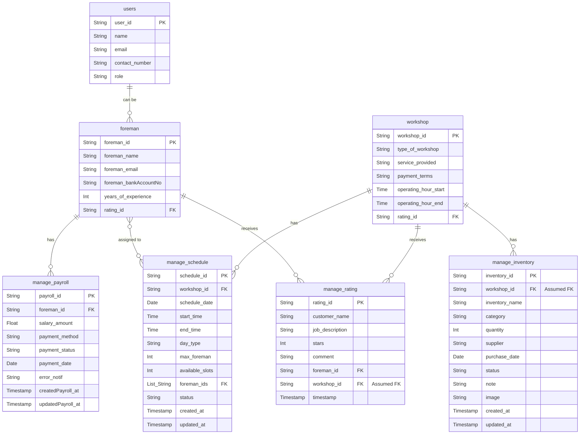

# Initial ERD Description (Draft)

**Disclaimer:** This document provides an initial description of the Entity-Relationship Diagram (ERD) based on the provided image. This ERD is a working draft and is subject to change as the project evolves and requirements are further clarified.

## Overview

The system involves several key entities related to managing workshops, foremen, users, schedules, ratings, inventory, and payroll.

## Entities and Attributes

Below are the identified entities, their attributes, and key types (PK - Primary Key, FK - Foreign Key).

### 1. `users`
*   `user_id` (PK, String/UUID)
*   `name` (String) - *Note: Marked as FK in diagram, target unclear, treated as attribute for now.*
*   `email` (String, Unique)
*   `contact_number` (String)
*   `role` (String, e.g., 'workshop_owner', 'foreman', 'admin')

### 2. `foreman`
*   `foreman_id` (PK, String/UUID) - *Potentially FK to `users.user_id` if a foreman is always a user.*
*   `foreman_name` (String)
*   `foreman_email` (String, Unique)
*   `foreman_bankAccountNo` (String)
*   `years_of_experience` (Integer)
*   `rating_id` (FK, String/UUID) - *Links to a summary rating or a specific rating in `manage_rating`. The `manage_rating` table also has `foreman_id`, suggesting a one-to-many relationship from foreman to ratings.*

### 3. `workshop`
*   `workshop_id` (PK, String/UUID)
*   `type_of_workshop` (String) - *Note: Marked as FK in diagram, target unclear, treated as attribute for now.*
*   `service_provided` (String/List<String>)
*   `payment_terms` (String)
*   `operating_hour_start` (Time/Timestamp)
*   `operating_hour_end` (Time/Timestamp)
*   `rating_id` (FK, String/UUID) - *Similar to `foreman.rating_id`, links to `manage_rating`.*

### 4. `manage_schedule`
*   `schedule_id` (PK, String/UUID)
*   `workshop_id` (FK, String/UUID) - Links to `workshop.workshop_id`
*   `schedule_date` (Date/Timestamp)
*   `start_time` (Time/Timestamp)
*   `end_time` (Time/Timestamp)
*   `day_type` (String, e.g., 'weekday', 'weekend', 'holiday')
*   `max_foreman` (Integer)
*   `available_slots` (Integer)
*   `foreman_ids` (List<String/UUID>) - Links to `foreman.foreman_id` (supporting multiple foremen per schedule)
*   `status` (String, e.g., 'open', 'filled', 'cancelled')
*   `created_at` (Timestamp)
*   `updated_at` (Timestamp)

### 5. `manage_rating`
*   `rating_id` (PK, String/UUID)
*   `customer_name` (String) - *Could be `user_id` if ratings are by registered users.*
*   `job_description` (String)
*   `stars` (Integer, 1-5)
*   `comment` (String)
*   `foreman_id` (FK, String/UUID) - Links to `foreman.foreman_id` (if rating is for a foreman)
*   `workshop_id` (FK, String/UUID) - *Assumed, to link ratings to workshops. Not explicitly in diagram but implied by relationship line.*
*   `timestamp` (Timestamp)

### 6. `manage_inventory`
*   `inventory_id` (PK, String/UUID)
*   `workshop_id` (FK, String/UUID) - *Assumed from relationship, links to `workshop.workshop_id`.*
*   `inventory_name` (String)
*   `category` (String)
*   `quantity` (Integer)
*   `supplier` (String)
*   `purchase_date` (Date/Timestamp)
*   `status` (String)
*   `note` (String)
*   `image` (String/URL)
*   `created_at` (Timestamp)
*   `updated_at` (Timestamp)

### 7. `manage_payroll`
*   `payroll_id` (PK, String/UUID)
*   `foreman_id` (FK, String/UUID) - Links to `foreman.foreman_id`
*   `salary_amount` (Decimal/Float)
*   `payment_method` (String)
*   `payment_status` (String)
*   `payment_date` (Date/Timestamp)
*   `error_notif` (String/Boolean)
*   `createdPayroll_at` (Timestamp)
*   `updatedPayroll_at` (Timestamp)

## Relationships (Visualized)

*Note: The Mermaid diagram above is an interpretation. Cardinality (e.g., `||--o{`, `}o--o{`) represents one-to-many, many-to-many, etc., based on the ERD image and common patterns.*

## Further Considerations / Questions
*   Clarify the nature of FKs for `users.name` and `workshop.type_of_workshop`.
*   Define the relationship between `users` and `foreman` more precisely (e.g., is a foreman always a user? If so, `foreman_id` could be `user_id`).
*   Confirm if `manage_rating` needs a `workshop_id` for workshop-specific ratings.
*   Confirm if `manage_inventory` needs `workshop_id`.
