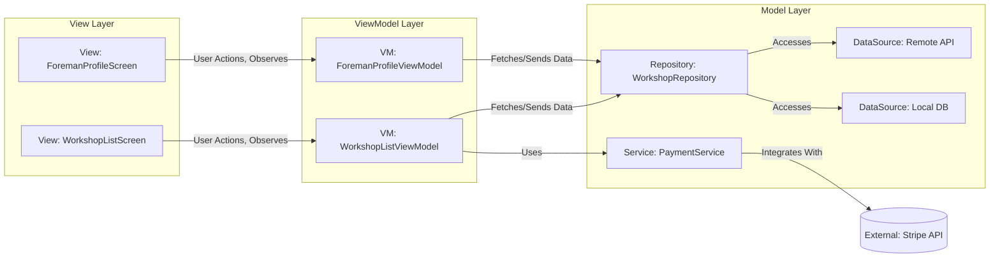

# Flutter for Laravel Developers: A Project Onboarding Guide

Welcome to the Flutter project! As developers familiar with the Laravel framework, you'll find many analogous concepts in our Flutter application, albeit with different terminologies and paradigms. This document aims to bridge that gap, helping you quickly get up to speed with our project's structure, architecture, and core technologies by relating them to your Laravel experience.

## 1. Project Structure: `lib` Folder vs. `app` Directory

In Laravel, your core application logic resides primarily within the `app/` directory, containing Models, Controllers, Services, etc. In Flutter, the equivalent is the `lib/` directory. This is where all your Dart source code lives.

```
.
├── lib/
│   ├── main.dart             # Entry point, similar to Laravel's public/index.php or bootstrap/app.php
│   ├── config/               # Application-wide configurations (e.g., router setup)
│   ├── models/               # Data structures/entities (similar to Laravel Eloquent Models, but without ORM logic)
│   ├── repositories/         # Abstraction for data sources (similar to Laravel Repositories or direct Model interaction)
│   ├── services/             # Business logic, external API interactions (similar to Laravel Services)
│   ├── ui/                   # UI-specific components and their ViewModels (e.g., `ui/user_rating/view_model/user_rating_viewmodel.dart`)
│   ├── viewmodels/           # Presentation logic and state for Views (similar to what a Laravel Controller prepares for a Blade view)
│   └── views/                # User Interface widgets (similar to Laravel Blade templates)
└── ...
```

## 2. Architecture: MVVM (Model-View-ViewModel) vs. MVC (Model-View-Controller)

While Laravel follows the MVC pattern, our Flutter project strictly adheres to MVVM. The core principle remains separation of concerns, but the roles are distributed differently.

### Core Principles of MVVM in Flutter:

*   **View:** In Flutter, the View is typically represented by `Widget`s. Views are responsible for the user interface (UI) and for displaying data. They observe changes in the ViewModel and update themselves accordingly. Views should be "dumb" and contain minimal logic, delegating all business logic and state management to their corresponding ViewModel.
    *   **Laravel Analogy:** Similar to a Blade template, but with reactive capabilities.
*   **ViewModel:** The ViewModel is a Dart class that acts as an intermediary between the View and the Model. It holds the presentation logic and state for a specific View. ViewModels expose data to the View through observable properties (e.g., using `ChangeNotifier` with the **Provider** package for state management and dependency injection). They also handle user input from the View and interact with the Model layer to fetch or manipulate data. Each View should have one, and only one, corresponding ViewModel.
    *   **Laravel Analogy:** Similar to what a Laravel Controller prepares for a Blade view, but also manages the state and reacts to user input.
*   **Model:** The Model layer represents the application's data and business logic. It typically consists of:
    *   **Repositories:** Abstract data sources and provide a clean API for ViewModels to interact with data (e.g., fetching data from a database or API).
        *   **Laravel Analogy:** Similar to Laravel Repositories or direct Eloquent Model interaction, but focused on data abstraction.
    *   **Services:** Contain business logic that might span multiple repositories or perform complex operations.
        *   **Laravel Analogy:** Similar to Laravel Services.
    *   **Data Sources:** Implementations for fetching data from specific sources (e.g., `RemoteDataSource` for APIs, `LocalDataSource` for local databases/storage).
        *   **Laravel Analogy:** Similar to how you might interact with external APIs or databases directly in Laravel.

### Interaction Flow Diagram:



### Data Flow Comparison (Laravel MVC vs. Flutter MVVM):

*   **Laravel MVC:**
    1.  **Request:** User interacts with the View (Blade template).
    2.  **Route:** Request is routed to a Controller.
    3.  **Controller:** Interacts with Models (Eloquent) and Services to fetch/process data.
    4.  **Controller:** Passes data to the View.
    5.  **View:** Renders the data.
*   **Flutter MVVM:**
    1.  **User Action (View):** User interacts with a Widget (View).
    2.  **Delegation (View to ViewModel):** View calls a method on its associated ViewModel.
    3.  **Logic (ViewModel):** ViewModel processes the action, potentially interacting with Repositories/Services (Model layer) to fetch/manipulate data.
    4.  **State Update (ViewModel):** ViewModel updates its internal state (observable properties).
    5.  **Reaction (View):** View observes the ViewModel's state changes and rebuilds/updates its UI accordingly.

## 3. State Management: Provider vs. Laravel Sessions/State

In Laravel, managing application state often involves sessions, caching, or passing data through the request lifecycle. In Flutter, especially with MVVM, state management is handled reactively, primarily using the `Provider` package.

*   **Provider:** This package is used for dependency injection and managing the lifecycle of ViewModels. ViewModels typically extend `ChangeNotifier`, and `Provider` allows Widgets (Views) to listen for changes in these ViewModels and rebuild efficiently.
    *   **Laravel Analogy:** While not a direct analogy, `Provider` helps manage application-wide or component-specific data and dependencies, similar to how Laravel's Service Container manages dependencies or how sessions might hold user-specific state.

### Example: Providing a ViewModel

```dart
// lib/views/auth/login_view.dart (simplified)
import 'package:flutter/material.dart';
import 'package:provider/provider.dart';
import 'package:workshop_system/viewmodels/auth/login_viewmodel.dart';
import 'package:workshop_system/services/auth_service.dart'; // Assuming AuthService is a dependency

class LoginView extends StatelessWidget {
  @override
  Widget build(BuildContext context) {
    return ChangeNotifierProvider(
      create: (context) => LoginViewModel(
        authService: Provider.of<AuthService>(context, listen: false),
      ),
      child: Consumer<LoginViewModel>(
        builder: (context, viewModel, child) {
          return Scaffold(
            appBar: AppBar(title: Text('Login')),
            body: Padding(
              padding: const EdgeInsets.all(16.0),
              child: Column(
                children: [
                  TextField(
                    onChanged: (value) => viewModel.email = value,
                    decoration: InputDecoration(labelText: 'Email'),
                  ),
                  TextField(
                    onChanged: (value) => viewModel.password = value,
                    obscureText: true,
                    decoration: InputDecoration(labelText: 'Password'),
                  ),
                  SizedBox(height: 20),
                  ElevatedButton(
                    onPressed: viewModel.isLoading ? null : () async {
                      await viewModel.login();
                      // Handle navigation after login (e.g., to main menu)
                      // context.go('/main_menu');
                    },
                    child: viewModel.isLoading
                        ? CircularProgressIndicator()
                        : Text('Login'),
                  ),
                  if (viewModel.errorMessage != null)
                    Text(viewModel.errorMessage!, style: TextStyle(color: Colors.red)),
                ],
              ),
            ),
          );
        },
      ),
    );
  }
}

// lib/viewmodels/auth/login_viewmodel.dart (simplified)
import 'package:flutter/foundation.dart';
import 'package:workshop_system/services/auth_service.dart';

class LoginViewModel extends ChangeNotifier {
  final AuthService _authService;

  String _email = '';
  String _password = '';
  bool _isLoading = false;
  String? _errorMessage;

  LoginViewModel({required AuthService authService}) : _authService = authService;

  String get email => _email;
  set email(String value) {
    _email = value;
    notifyListeners();
  }

  String get password => _password;
  set password(String value) {
    _password = value;
    notifyListeners();
  }

  bool get isLoading => _isLoading;
  set isLoading(bool value) {
    _isLoading = value;
    notifyListeners();
  }

  String? get errorMessage => _errorMessage;
  set errorMessage(String? value) {
    _errorMessage = value;
    notifyListeners();
  }

  Future<void> login() async {
    isLoading = true;
    errorMessage = null;
    try {
      await _authService.signInWithEmailAndPassword(_email, _password);
      // Login successful, handle navigation in the View
    } catch (e) {
      errorMessage = e.toString();
    } finally {
      isLoading = false;
    }
  }
}
```

## 4. Navigation: `go_router` vs. Laravel Routes

Laravel uses a `web.php` or `api.php` file to define routes, mapping URLs to controller actions. Flutter's `go_router` provides a declarative way to manage navigation, building a navigation stack.

*   **`go_router`:** A declarative routing package for Flutter that allows for complex navigation patterns, deep linking, and URL-based routing.
    *   **Laravel Analogy:** Similar to Laravel's routing system, but for client-side navigation within the app.

### Key Navigation Methods:

*   **`context.push('/path')`**:
    *   **Purpose**: Use when navigating to a new screen where the user should be able to return to the previous screen using the system back button or an in-app back button.
    *   **Behavior**: Adds the new route on top of the current navigation stack, preserving the history.
    *   **Laravel Analogy:** Similar to a redirect that allows going back (e.g., `return redirect()->back()` or simply navigating to a new page while keeping history).
*   **`context.go('/path')`**:
    *   **Purpose**: Use when navigating to a new screen that should replace the current navigation stack. This is typically for transitions where going back to the previous screen doesn't make logical sense.
    *   **Behavior**: Replaces the current route in the navigation stack, effectively clearing the history up to that point.
    *   **Laravel Analogy:** Similar to `return redirect()->intended('/home')` after login, where you don't want the user to go back to the login page.

### Example: `lib/config/router.dart`

```dart
import 'package:go_router/go_router.dart';
import 'package:flutter/material.dart';
import 'package:workshop_system/views/auth/login_view.dart';
import 'package:workshop_system/views/auth/welcome_view.dart';
import 'package:workshop_system/views/main_menu_view.dart';
import 'package:workshop_system/views/auth/foreman_register_view.dart';
import 'package:workshop_system/views/auth/workshop_register_view.dart';
import 'package:workshop_system/views/foreman/workshop_search_view.dart';
import 'package:workshop_system/views/manage_payroll/pending_payroll_view.dart';
import 'package:workshop_system/views/manage_payroll/salary_detail_view.dart';
import 'package:workshop_system/views/profile/foreman_display_profile_view.dart';
import 'package:workshop_system/views/profile/workshop_display_profile_view.dart';
import 'package:workshop_system/views/profile/edit_foreman_profile_view.dart';
import 'package:workshop_system/views/profile/edit_workshop_profile_view.dart';

final GoRouter router = GoRouter(
  routes: <GoRoute>[
    GoRoute(
      path: '/',
      builder: (BuildContext context, GoRouterState state) {
        return WelcomeView();
      },
    ),
    GoRoute(
      path: '/login',
      builder: (BuildContext context, GoRouterState state) {
        return LoginView();
      },
    ),
    GoRoute(
      path: '/foreman_register',
      builder: (BuildContext context, GoRouterState state) {
        return ForemanRegisterView();
      },
    ),
    GoRoute(
      path: '/workshop_register',
      builder: (BuildContext context, GoRouterState state) {
        return WorkshopRegisterView();
      },
    ),
    GoRoute(
      path: '/main_menu',
      builder: (BuildContext context, GoRouterState state) {
        return MainMenuView();
      },
    ),
    GoRoute(
      path: '/workshop_search',
      builder: (BuildContext context, GoRouterState state) {
        return WorkshopSearchView();
      },
    ),
    GoRoute(
      path: '/pending_payroll',
      builder: (BuildContext context, GoRouterState state) {
        return PendingPayrollView();
      },
    ),
    GoRoute(
      path: '/salary_detail/:payrollId', // Example with path parameter
      builder: (BuildContext context, GoRouterState state) {
        final payrollId = state.pathParameters['payrollId'];
        return SalaryDetailView(payrollId: payrollId);
      },
    ),
    GoRoute(
      path: '/foreman_profile',
      builder: (BuildContext context, GoRouterState state) {
        return ForemanDisplayProfileView();
      },
    ),
    GoRoute(
      path: '/workshop_profile',
      builder: (BuildContext context, GoRouterState state) {
        return WorkshopDisplayProfileView();
      },
    ),
    GoRoute(
      path: '/edit_foreman_profile',
      builder: (BuildContext context, GoRouterState state) {
        return EditForemanProfileView();
      },
    ),
    GoRoute(
      path: '/edit_workshop_profile',
      builder: (BuildContext context, GoRouterState state) {
        return EditWorkshopProfileView();
      },
    ),
  ],
);
```

## 5. Data Access: Firebase vs. Eloquent ORM

In Laravel, you primarily interact with databases using Eloquent ORM, which maps database tables to PHP objects. In Flutter, our project leverages Firebase services (Firestore, Authentication, Storage) for backend data persistence and authentication.

*   **Firebase:** A suite of backend services provided by Google.
    *   **Cloud Firestore:** A NoSQL document database.
        *   **Laravel Analogy:** Similar to a database, but document-based rather than relational. Data is structured in collections and documents.
    *   **Firebase Authentication:** Manages user authentication.
        *   **Laravel Analogy:** Similar to Laravel's built-in authentication system (e.g., Laravel Breeze, Jetstream).
    *   **Firebase Storage:** Stores user-generated content like images.
        *   **Laravel Analogy:** Similar to storing files on a disk or cloud storage (e.g., S3) in Laravel.

### Repository Pattern with Firebase:

Our project uses a Repository pattern to abstract data sources, making it easier to switch between different backend implementations if needed. ViewModels interact with Repositories, which then interact with Firebase services.

### Example: `lib/services/firestore_service.dart` and `lib/repositories/user_repository.dart`

```dart
// lib/services/firestore_service.dart (simplified)
import 'package:cloud_firestore/cloud_firestore.dart';

class FirestoreService {
  final FirebaseFirestore _db = FirebaseFirestore.instance;

  // Example: Get a document by path
  Stream<DocumentSnapshot> getDocumentStream(String path) {
    return _db.doc(path).snapshots();
  }

  // Example: Get a collection by path
  Stream<QuerySnapshot> getCollectionStream(String path) {
    return _db.collection(path).snapshots();
  }

  // Example: Add data to a collection
  Future<void> addDocument(String collectionPath, Map<String, dynamic> data) {
    return _db.collection(collectionPath).add(data);
  }

  // Example: Set data for a document (create or overwrite)
  Future<void> setDocument(String docPath, Map<String, dynamic> data) {
    return _db.doc(docPath).set(data);
  }

  // Example: Update specific fields in a document
  Future<void> updateDocument(String docPath, Map<String, dynamic> data) {
    return _db.doc(docPath).update(data);
  }

  // Example: Delete a document
  Future<void> deleteDocument(String docPath) {
    return _db.doc(docPath).delete();
  }
}

// lib/repositories/user_repository.dart (simplified)
import 'package:workshop_system/models/app_user_model.dart'; // Assuming AppUser is your user model
import 'package:workshop_system/services/firestore_service.dart';
import 'package:firebase_auth/firebase_auth.dart';

class UserRepository {
  final FirestoreService _firestoreService;
  final FirebaseAuth _firebaseAuth; // For getting current user ID

  UserRepository({
    required FirestoreService firestoreService,
    required FirebaseAuth firebaseAuth,
  })  : _firestoreService = firestoreService,
        _firebaseAuth = firebaseAuth;

  static const String _collectionPath = 'users';

  Future<AppUser?> getCurrentUser() async {
    final user = _firebaseAuth.currentUser;
    if (user == null) return null;

    final doc = await _firestoreService.getDocumentStream('$_collectionPath/${user.uid}').first;
    if (doc.exists) {
      return AppUser.fromMap(doc.data()!, doc.id);
    }
    return null;
  }

  Future<void> createUserProfile(AppUser user) async {
    await _firestoreService.setDocument('$_collectionPath/${user.id}', user.toMap());
  }

  Future<void> updateUserProfile(AppUser user) async {
    await _firestoreService.updateDocument('$_collectionPath/${user.id}', user.toMap());
  }

  // Other user-related data operations
}
```

## 6. Payment Integration: Stripe

In Laravel, payment processing often involves packages like Laravel Cashier, which provides an expressive interface for Stripe's subscription billing services. In Flutter, we integrate directly with the Stripe SDK.

*   **Stripe SDK for Flutter:** Provides client-side components and APIs to securely collect payment information.
    *   **Laravel Analogy:** While Laravel Cashier simplifies server-side subscription management, the Flutter Stripe SDK handles the client-side UI and tokenization, similar to how you might use Stripe.js on the frontend in a Laravel web application.

### Payment Flow:

1.  **Client (Flutter App):** Collects sensitive payment details (e.g., card number) using Stripe's secure UI components (e.g., `CardFormField`).
2.  **Client (Flutter App):** Tokenizes the payment details using the Stripe SDK, sending them directly to Stripe's servers. This returns a secure, single-use token.
3.  **Client (Flutter App):** Sends this token to your backend (e.g., a Firebase Cloud Function or a Laravel API endpoint).
4.  **Backend (Firebase Cloud Function/Laravel API):** Uses the Stripe token to create a charge, subscription, or customer on the Stripe platform. This is where your secret API key is used.
5.  **Backend:** Communicates the result back to the Flutter app.

### Security Considerations:

*   **PCI Compliance:** Sensitive card data never touches your Flutter app's backend directly; it's tokenized by Stripe's SDK on the client-side. This significantly reduces your PCI compliance burden.
*   **Secret Keys:** Your Stripe secret API keys must *never* be exposed in your Flutter client-side code. All operations requiring secret keys must be performed on a secure backend.

This guide should provide a solid foundation for Laravel developers transitioning to our Flutter project. Remember to always refer to the official Flutter and package documentation for deeper understanding.
