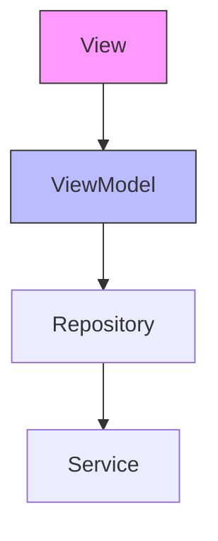

# Provider Implementation Correction Report

## Issue Summary
- The initial setup in `main.dart` used `ChangeNotifierProxyProvider2` to provide `PendingPayrollViewModel` at a global level.
- This approach violated the project's MVVM guidelines, which state that ViewModels should be provided locally within the View widget that requires them.
- The use of `ProxyProvider` and its `update` method was unnecessarily complex and could lead to inefficient widget rebuilds or state management issues.

## Architecture Principles Applied
This correction aligns the `PendingPayrollViewModel` provisioning with the project's established MVVM architecture guidelines, specifically:
- **View-ViewModel Relationship**: Each View (UI component/screen) must have one, and only one, corresponding ViewModel.
- **ViewModel Responsibility**: ViewModels hold the state and presentation logic for their associated View.
- **ViewModel Provisioning**: ViewModels should be provided locally within the View widget that requires them using `ChangeNotifierProvider`.

## Changes Implemented

### 1. Global Provider Removal (`lib/main.dart`)
The `ChangeNotifierProxyProvider2` declaration for `PendingPayrollViewModel` was removed from the `MultiProvider` list in `main.dart`.

**Before (in `lib/main.dart`):**
```dart
// ... other providers
ChangeNotifierProxyProvider2<PayrollRepository, PaymentServiceFactory, PendingPayrollViewModel>(
  create: (context) => PendingPayrollViewModel(
    Provider.of<PayrollRepository>(context, listen: false),
    Provider.of<PaymentServiceFactory>(context, listen: false),
  ),
  update: (context, payrollRepo, paymentFactory, viewModel) =>
    viewModel!..updateDependencies(payrollRepo, paymentFactory),
),
// ...
```

**After (in `lib/main.dart`):**
```dart
// ... other providers
// (The above ChangeNotifierProxyProvider2 block was removed)
// ...
```

### 2. Local Provider Implementation (`lib/config/router.dart`)
The `PendingPayrollViewModel` is now provided locally at the point where `PendingPayrollView` is routed to, using `ChangeNotifierProvider`. This ensures the ViewModel's lifecycle is tied to its view.

**Before (in `lib/config/router.dart`):**
```dart
GoRoute(
  path: '/pending-payroll',
  builder: (context, state) => PendingPayrollView(),
),
```

**After (in `lib/config/router.dart`):**
```dart
GoRoute(
  path: '/pending-payroll',
  builder: (context, state) => ChangeNotifierProvider(
    create: (context) => PendingPayrollViewModel(
      Provider.of<PayrollRepository>(context, listen: false),
      Provider.of<PaymentServiceFactory>(context, listen: false),
    ),
    child: PendingPayrollView(),
  ),
),
```
Additionally, the following imports were added to `lib/config/router.dart` to resolve compilation errors:
```dart
import 'package:workshop_system/repositories/payroll_repository.dart';
import 'package:workshop_system/services/payment_api_service.dart';
import 'package:workshop_system/viewmodels/manage_payroll/pending_payroll_viewmodel.dart';
```

### 3. ViewModel Cleanup (`lib/viewmodels/manage_payroll/pending_payroll_viewmodel.dart`)
The redundant `updateDependencies` method was removed from `PendingPayrollViewModel`, as it is no longer necessary with the local provisioning approach.

**Before (in `lib/viewmodels/manage_payroll/pending_payroll_viewmodel.dart`):**
```dart
class PendingPayrollViewModel with ChangeNotifier {
  // ...
  PendingPayrollViewModel(this._payrollRepo, this._paymentServiceFactory) {
    _loadPayrolls();
  }

  void updateDependencies(PayrollRepository repo, PaymentServiceFactory factory) {
    _payrollRepo = repo;
    _payrollServiceFactory = factory;
    _loadPayrolls();
  }
  // ...
}
```

**After (in `lib/viewmodels/manage_payroll/pending_payroll_viewmodel.dart`):**
```dart
class PendingPayrollViewModel with ChangeNotifier {
  // ...
  PendingPayrollViewModel(this._payrollRepo, this._paymentServiceFactory) {
    _loadPayrolls();
  }
  // (The updateDependencies method was removed)
  // ...
}
```

## Benefits Achieved
- ✅ **Adherence to MVVM**: The ViewModel provisioning now strictly follows the project's MVVM architectural guidelines.
- ✅ **Proper Scoping**: The ViewModel's lifecycle is correctly scoped to its associated view, improving resource management.
- ✅ **Simplified Code**: The Provider setup is cleaner and easier to understand.
- ✅ **Improved Performance**: Avoids unnecessary widget rebuilds that could occur with the `ProxyProvider`'s `update` method.
- ✅ **Maintainability**: The codebase is more consistent and easier to maintain.

## MVVM Flow Diagram


### 4. Repository Provisioning Correction (`lib/main.dart`)
After the initial changes, an error "could not find Provider<PayrollRepository>" was encountered. This was due to `PayrollRepository` not being explicitly provided at a global level after the `PendingPayrollViewModel`'s `ProxyProvider` was removed from `main.dart`.

**Solution:**
A `ProxyProvider` for `PayrollRepository` was added to `lib/main.dart` to ensure its availability throughout the application.

**Before (in `lib/main.dart`):**
```dart
// ...
// (PayrollRepository was not explicitly provided here)
// ...
```

**After (in `lib/main.dart`):**
```dart
// ...
ProxyProvider<FirestoreService, PayrollRepository>(
  update: (context, firestoreService, previousPayrollRepository) =>
      PayrollRepository(firestoreService),
),
// ...
